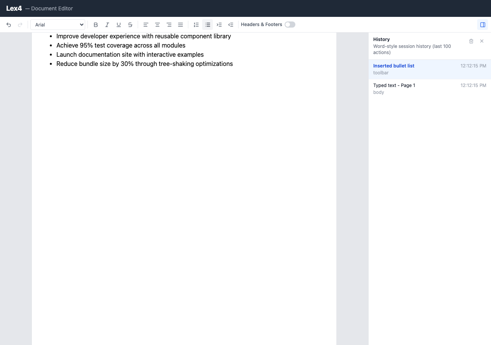
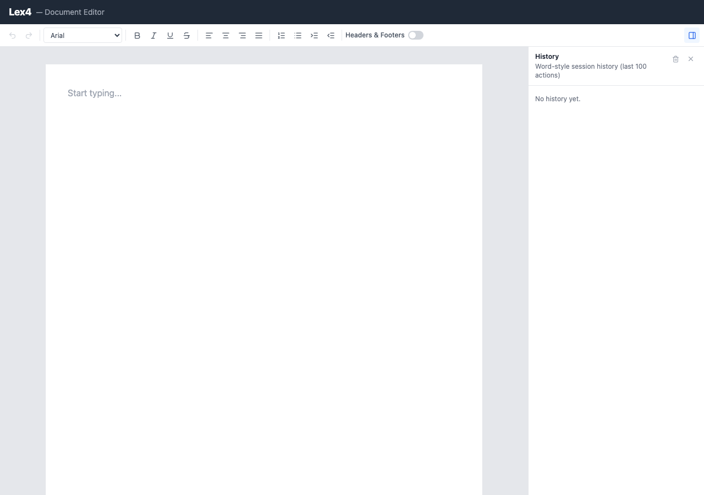
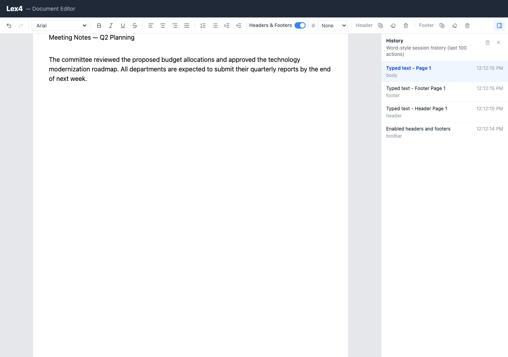
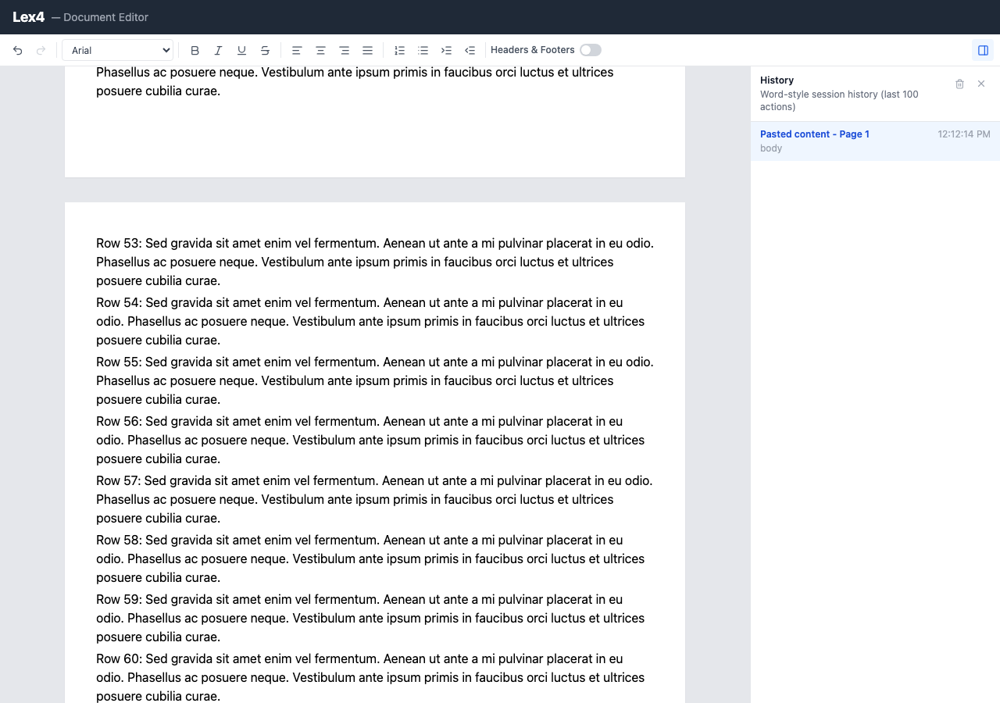
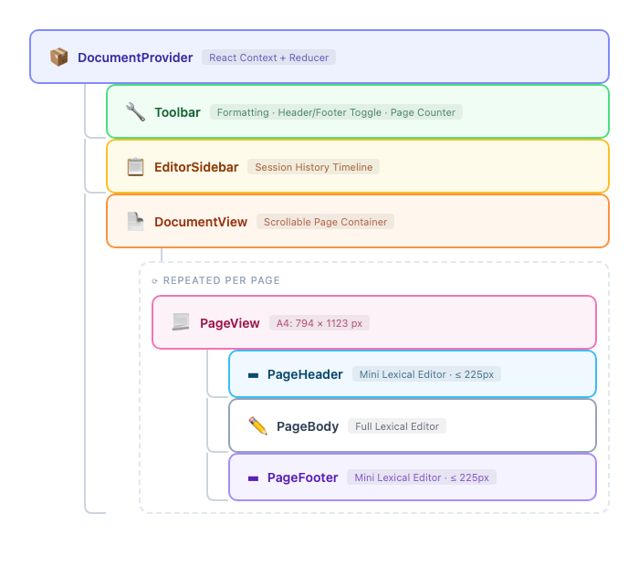
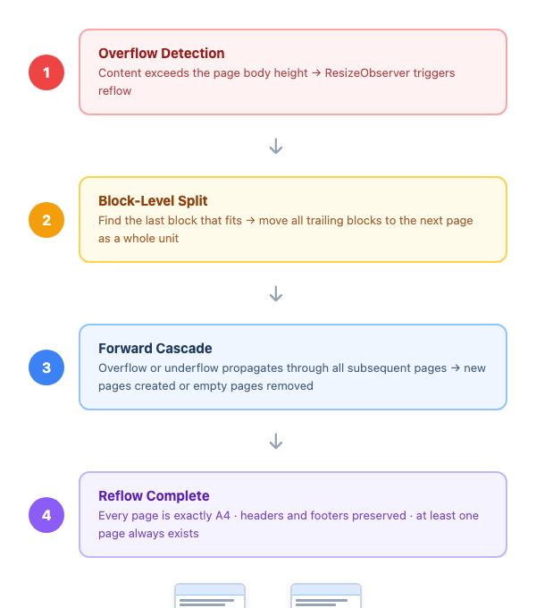

<div align="center">

# Lex4

**A paginated A4 document editor for React**

> Meta **Lex**ical × **A4** page rules

[](https://github.com/yurikilian/lex4/actions/workflows/ci.yml)
[](https://www.npmjs.com/package/@lex4/editor)
[](./LICENSE)
[](https://www.typescriptlang.org/)
[](https://react.dev/)

[Live Demo](https://yurikilian.github.io/lex4/) · [npm Package](https://www.npmjs.com/package/@lex4/editor) · [Report Bug](https://github.com/yurikilian/lex4/issues)

</div>

---

A paginated document editor built as a **reusable React library** on top of [Meta Lexical](https://lexical.dev/). Every page is a true discrete A4 page — no fake pages, no CSS hacks, no single-editor visual tricks.

<div align="center">



</div>

## ✨ Features

- **True A4 pagination** — every page is exactly 794 × 1123 CSS pixels (210mm × 297mm at 96 DPI)
- **Automatic content flow** — overflow splits at block boundaries, underflow pulls content back
- **Rich text formatting** — bold, italic, underline, strikethrough, alignment, lists, indentation
- **Headers & footers** — global toggle with per-page editable regions and page counters
- **Multiple font families** — Arial, Times New Roman, Courier New, Georgia, Verdana and more
- **Session history sidebar** — Word-style action timeline with full undo/redo
- **Serializable document model** — typed AST export/import for backend persistence
- **Read-only mode** — disable editing while keeping the document viewable
- **Zero config** — drop in the component and start editing

## 📸 Screenshots

<details>
<summary><strong>Empty Editor</strong> — clean A4 page ready for editing</summary>



</details>

<details>
<summary><strong>Headers & Footers</strong> — global toggle with editable regions</summary>



</details>

<details>
<summary><strong>Multi-Page Document</strong> — automatic content flow across pages</summary>



</details>

<details>
<summary><strong>Toolbar</strong> — full formatting controls</summary>


</details>

## 📦 Installation

```bash
npm install @lex4/editor
# or
pnpm add @lex4/editor
# or
yarn add @lex4/editor
```

### Peer Dependencies

The library requires React 18+ and Lexical 0.22+ as peer dependencies:

```bash
npm install react react-dom lexical @lexical/react @lexical/rich-text @lexical/list @lexical/history @lexical/selection @lexical/utils @lexical/clipboard @lexical/html
```

## 🚀 Quick Start

```tsx
import { Lex4Editor } from '@lex4/editor';
import '@lex4/editor/style.css';

function App() {
  return (
    <Lex4Editor
      onDocumentChange={(doc) => console.log(doc)}
    />
  );
}
```

### With Initial Document

```tsx
import { Lex4Editor, createEmptyDocument } from '@lex4/editor';
import '@lex4/editor/style.css';

function App() {
  const initialDoc = createEmptyDocument();

  return (
    <Lex4Editor
      initialDocument={initialDoc}
      headerFooterEnabled={true}
      onDocumentChange={(doc) => saveToBackend(doc)}
      onHeaderFooterToggle={(enabled) => console.log('Headers:', enabled)}
    />
  );
}
```

### Read-Only Viewer

```tsx
<Lex4Editor
  initialDocument={savedDocument}
  readOnly={true}
/>
```

## 📖 API Reference

### `<Lex4Editor />` Component

The main editor component. Drop it into any React application.

| Prop | Type | Default | Description |
|------|------|---------|-------------|
| `initialDocument` | `Lex4Document` | Empty document | Pre-populate the editor with saved content |
| `onDocumentChange` | `(doc: Lex4Document) => void` | — | Called on every document mutation |
| `headerFooterEnabled` | `boolean` | `false` | Initial header/footer toggle state |
| `onHeaderFooterToggle` | `(enabled: boolean) => void` | — | Called when the user toggles headers/footers |
| `readOnly` | `boolean` | `false` | Disable editing (view-only mode) |
| `captureHistoryShortcutsOnWindow` | `boolean` | `true` | Capture ⌘Z/⌘⇧Z at the window level |
| `className` | `string` | — | Additional CSS class for the editor root |

### Types

```ts
import type { SerializedEditorState } from 'lexical';

type PageCounterMode = 'none' | 'header' | 'footer' | 'both';

/** Top-level document state — serialize this to persist documents */
interface Lex4Document {
  pages: PageState[];
  headerFooterEnabled: boolean;
  pageCounterMode: PageCounterMode;
  defaultHeaderState: SerializedEditorState | null;
  defaultFooterState: SerializedEditorState | null;
  defaultHeaderHeight: number;
  defaultFooterHeight: number;
}

/** State for a single page */
interface PageState {
  id: string;
  bodyState: SerializedEditorState | null;
  headerState: SerializedEditorState | null;
  footerState: SerializedEditorState | null;
  headerHeight: number;
  footerHeight: number;
  bodySyncVersion: number;
  headerSyncVersion: number;
  footerSyncVersion: number;
}
```

### Helper Functions

| Function | Signature | Description |
|----------|-----------|-------------|
| `createEmptyDocument()` | `() => Lex4Document` | Creates a blank document with one empty A4 page |
| `createEmptyPage()` | `(id?: string) => PageState` | Creates a single empty page |

### Constants

| Constant | Value | Description |
|----------|-------|-------------|
| `A4_WIDTH_PX` | `794` | A4 width in CSS pixels at 96 DPI |
| `A4_HEIGHT_PX` | `1123` | A4 height in CSS pixels at 96 DPI |
| `A4_WIDTH_MM` | `210` | A4 width in millimeters |
| `A4_HEIGHT_MM` | `297` | A4 height in millimeters |
| `MAX_HEADER_HEIGHT_PX` | `225` | Maximum header height (20% of page) |
| `MAX_FOOTER_HEIGHT_PX` | `225` | Maximum footer height (20% of page) |

### Hooks

These hooks are exported for advanced use cases where you need to build custom page layouts:

| Hook | Description |
|------|-------------|
| `usePagination` | Core pagination logic — overflow/underflow detection and page management |
| `useOverflowDetection` | Monitors content height and triggers reflow when content exceeds the page body |
| `useHeaderFooter` | Header/footer state management and chrome template application |

## 🏗️ Architecture

### Multi-Editor Discrete Page Model

Unlike most web-based "paginated" editors that use a single editor with CSS visual breaks, Lex4 uses a **true multi-editor architecture** where each page body is an independent Lexical editor instance coordinated by a unified document state:

<div align="center">



</div>

### Content Flow Engine

The pagination engine is built as **pure functions** that transform page state arrays:

<div align="center">



</div>

### Key Invariants

- Every page is **exactly** A4 (794 × 1123 px at 96 DPI) — no dynamic heights
- Header and footer regions **never** overlap body content
- Overflow always creates **full A4 pages**, never partial pages
- At least **one page** always exists — the document is never empty
- Blocks move **whole** between pages (no mid-block splitting)

## 📁 Project Structure

```
lex4/
├── packages/
│   └── editor/               # @lex4/editor — the publishable library
│       ├── src/
│       │   ├── components/   # React components (Lex4Editor, PageView, Toolbar, etc.)
│       │   ├── constants/    # A4 dimensions, layout math
│       │   ├── context/      # DocumentProvider, document reducer, actions
│       │   ├── engine/       # Pagination logic — pure functions (reflow, overflow, paginate)
│       │   ├── hooks/        # usePagination, useOverflowDetection, useHeaderFooter
│       │   ├── lexical/      # Editor config, plugins (paste, history), custom commands
│       │   ├── types/        # TypeScript interfaces (Lex4Document, PageState, etc.)
│       │   └── utils/        # Editor state manipulation helpers
│       └── dist/             # Built output (ESM + CJS + types + CSS)
├── demo/                     # Demo app (deployed to GitHub Pages)
├── e2e/                      # Playwright end-to-end tests
├── .github/workflows/        # CI, npm publish, GitHub Pages deployment
└── docs/screenshots/         # Auto-generated screenshots for README
```

## 🛠️ Development

### Prerequisites

- **Node.js** ≥ 18
- **pnpm** ≥ 9

### Setup

```bash
# Clone the repo
git clone https://github.com/yurikilian/lex4.git
cd lex4

# Install dependencies
pnpm install

# Build the library
pnpm build

# Start the demo app at http://localhost:3000
pnpm dev
```

### Commands

| Command | Description |
|---------|-------------|
| `pnpm dev` | Start the demo app dev server |
| `pnpm build` | Build the `@lex4/editor` library |
| `pnpm test` | Run unit tests (Vitest) |
| `pnpm test:e2e` | Run E2E tests (Playwright) |
| `pnpm lint` | Type-check all packages |

### Running E2E Tests

```bash
# Install Playwright browsers (first time only)
pnpm --filter e2e exec playwright install chromium

# Run all E2E tests
pnpm test:e2e

# Run with headed browser
pnpm --filter e2e test:headed

# Run with Playwright UI
pnpm --filter e2e test:ui
```

### Test Suite

| Category | Framework | Count | Description |
|----------|-----------|-------|-------------|
| Unit | Vitest | 89 | Engine logic, reducers, utilities, component rendering |
| E2E | Playwright | 80 | Full user flows — typing, formatting, pagination, header/footer, history |

## 🔧 Build & Bundle

The library is built with **Vite in library mode**, producing:

| Output | Path | Description |
|--------|------|-------------|
| ESM | `dist/lex4-editor.js` | ES module for modern bundlers |
| CJS | `dist/lex4-editor.cjs` | CommonJS for Node.js / legacy bundlers |
| Types | `dist/index.d.ts` | Full TypeScript declarations |
| CSS | `dist/style.css` | Compiled Tailwind styles |
| Source maps | `dist/*.map` | Debugging support |

React, ReactDOM, and all `@lexical/*` packages are **externalized** — they are not bundled and must be provided by the consuming application.

## 🚢 Publishing to npm

Releases are automated via GitHub Actions. To publish a new version:

1. Update the version in `packages/editor/package.json`
2. Commit and push to `main`
3. Create a [GitHub Release](https://github.com/yurikilian/lex4/releases/new) with a tag matching the version (e.g. `v0.2.0`)
4. The publish workflow runs CI, then publishes to npm with provenance

> **Note:** You need to add an `NPM_TOKEN` secret to the repository settings.

## 🌐 Demo Deployment

The demo app is automatically deployed to **GitHub Pages** on every push to `main`:

🔗 **[https://yurikilian.github.io/lex4/](https://yurikilian.github.io/lex4/)**

To deploy manually, trigger the workflow from the Actions tab.

## 🧩 Tech Stack

| Technology | Role |
|------------|------|
| [TypeScript](https://www.typescriptlang.org/) | Static typing |
| [React 18](https://react.dev/) | UI framework |
| [Meta Lexical](https://lexical.dev/) | Rich text editing engine |
| [Vite](https://vitejs.dev/) | Library build (ESM + CJS) and dev server |
| [Tailwind CSS](https://tailwindcss.com/) | Styling |
| [Vitest](https://vitest.dev/) | Unit testing |
| [Playwright](https://playwright.dev/) | End-to-end testing |
| [pnpm](https://pnpm.io/) | Package manager (monorepo workspaces) |
| [GitHub Actions](https://github.com/features/actions) | CI/CD, npm publish, Pages deployment |

## ⚠️ Known Limitations

| Limitation | Details |
|------------|---------|
| **No mid-block splitting** | Blocks (paragraphs, list items) move whole between pages. A single block larger than a page body will overflow visually. |
| **Heuristic initial pagination** | Block heights are estimated at 24px per line until the first render. `ResizeObserver` corrects this on mount. |
| **No collaborative editing** | The document model is designed for single-user editing. Real-time collaboration (e.g. CRDT/OT) is out of scope. |
| **No table support** | Tables are not supported as block types. |

## 🤝 Contributing

Contributions are welcome! Please:

1. Fork the repository
2. Create a feature branch (`git checkout -b feat/my-feature`)
3. Commit your changes with clear messages
4. Push to your fork and open a Pull Request

Please ensure `pnpm lint && pnpm build && pnpm test` pass before submitting.

## 📄 License

[MIT](./LICENSE) © [Yuri Kilian](https://github.com/yurikilian)
